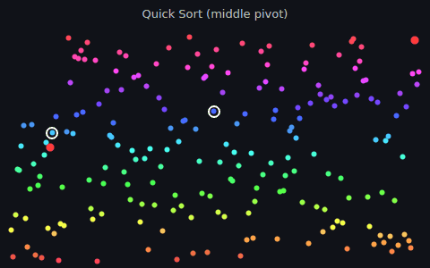
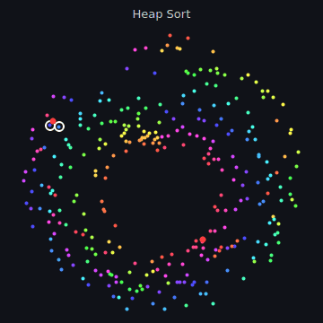
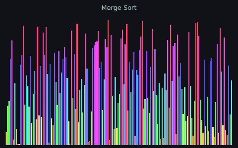
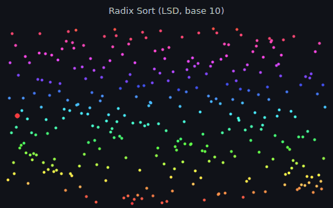
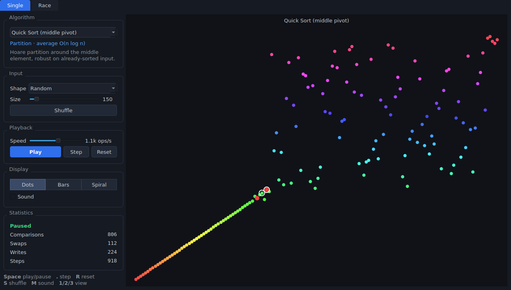
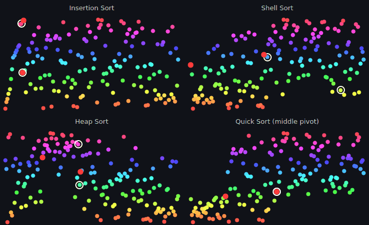

# Visual Sorting

Watch the patterns sorting algorithms leave behind.

<p align="center">
  
  
</p>
<p align="center">
  
  
</p>

Visual Sorting is a desktop app (PySide6 + pyqtgraph) that animates 18 sorting
algorithms step by step. Every element is coloured by its value, so you can follow
where each one travels. Comparisons are ringed in white and writes are marked in red.



## Features

- **18 algorithms**: bubble (unflagged and flagged), cocktail shaker, comb, gnome,
  odd-even, insertion, shell, selection, heap, quick sort (leftmost and middle
  pivot), introsort, merge, simplified Timsort, counting, radix (LSD) and bitonic.
- **Three views of the same data**: *Dots* (value vs. index), *Bars*, and
  *Spiral* (angle is the position, and the distance from the rim is how far the
  element is from its sorted place, so a sorted array is a perfect colour wheel).
- **Input shapes**: random, reversed, nearly sorted, few unique, sorted, sawtooth.
  Sizes go from 8 to 2000 elements.
- **Playback controls**: play/pause, single step, reset to the same input, and
  reshuffle. The speed slider is logarithmic, from 2 to 200,000 operations per second.
- **Live statistics**: comparisons, swaps, array writes and total steps.
- **Race mode**: up to six algorithms sort identical copies of the same input
  side by side, and are ranked by finishing order.
- **Sound (optional, off by default)**: each access plays a pitch based on the
  value. Toggle it with the checkbox or the `M` key.

<p align="center">
  
</p>

## Install and run

Requires Python 3.10+.

```bash
git clone https://github.com/lnutimura/visual-sorting.git
cd visual-sorting
python -m venv .venv && source .venv/bin/activate
pip install -e .
visual-sorting          # or: python -m visual_sorting
```

On a minimal Linux install you may also need the system OpenGL/EGL libraries
(`sudo apt install libgl1 libegl1`). Sound uses Qt Multimedia. If no audio output
is available, the Sound checkbox is simply disabled.

## Keyboard shortcuts

| Key       | Action                          |
|-----------|---------------------------------|
| `Space`   | Play / pause (replays when done) |
| `.`       | Step one operation              |
| `R`       | Reset to the same input         |
| `S`       | Shuffle a new input             |
| `M`       | Toggle sound                    |
| `1` `2` `3` | Dots / Bars / Spiral view     |

## Algorithms

| Algorithm | Family | Average time |
|-----------|--------|--------------|
| Bubble Sort (unflagged / flagged) | Exchange | O(n²) |
| Cocktail Shaker Sort | Exchange | O(n²) |
| Comb Sort | Exchange | O(n² / 2^p) |
| Gnome Sort | Exchange | O(n²) |
| Odd-Even Sort | Exchange | O(n²) |
| Insertion Sort | Insertion | O(n²) |
| Shell Sort (gaps 2^k - 1) | Insertion | O(n^1.5) |
| Selection Sort | Selection | O(n²) |
| Heap Sort | Selection | O(n log n) |
| Quick Sort (leftmost / middle pivot) | Partition | O(n log n) |
| Introsort | Partition | O(n log n) |
| Merge Sort | Merge | O(n log n) |
| Timsort (simplified) | Merge | O(n log n) |
| Counting Sort | Distribution | O(n + k) |
| Radix Sort (LSD, base 10) | Distribution | O(d·n) |
| Bitonic Sort | Network | O(n log² n) |

In race mode every contestant gets the same number of *operations* (compare,
swap or write) per frame. Finishing order therefore reflects the work each
algorithm does, not how fast Python runs it.

## How it works

Each algorithm is a Python generator that reads the array and yields small
events (`Compare(i, j)`, `Swap(i, j)`, `Write(i, value)`) instead of touching
the GUI. A `Player` driven by a `QTimer` pulls as many events per frame as the
speed slider allows and applies them to the array, and the views redraw from it.
Because the algorithm never writes to the array itself, what you see is always
exactly the state the algorithm is working on.

```
src/visual_sorting/
  algorithms/      one module per family + the ALGORITHMS registry
  events.py        Compare / Swap / Write
  distributions.py input shapes
  player.py        SortRun (one algorithm on one array) and Player (timer)
  views.py         SortView: dots, bars, spiral
  sound.py         ToneEngine (Qt Multimedia synthesiser)
  widgets/         control panel, Single tab, Race tab
  app.py           main window, theme, shortcuts
```

Adding an algorithm means writing a generator and adding one line to the registry in
`algorithms/__init__.py`. The test suite checks it against every input shape and size.

## Development

```bash
pip install -e ".[dev]"
pytest
QT_QPA_PLATFORM=offscreen python scripts/record_gifs.py   # regenerate docs/
```

## History

This started in 2018 as a small PyQt4-era script: a pyqtgraph scatter plot,
radio buttons for nine algorithms, and red dots on a black background. The
original is still in the git history. Version 2 keeps those nine algorithms
and the dot "pattern" view, and rebuilds everything around them.

## License

[MIT](LICENSE)
